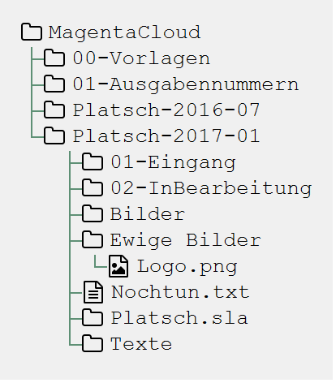
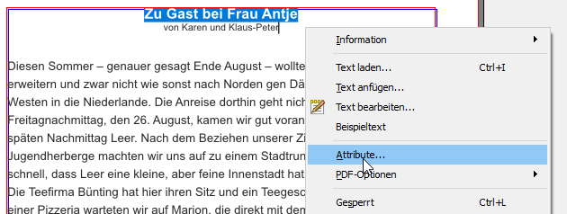
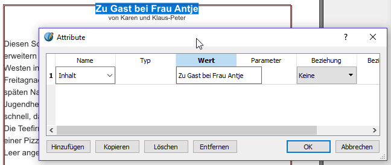

= Platsch - Layout
Mathias-H. Weber <mhw@teambaltic.de>
v1.0, 08. Januar 2017
:doctype: book
:encoding: utf-8
:lang: de
:toc: left
:toclevels: 4
:toc-title: Inhaltsverzeichnis
:last-update-label: Erstellt mit Asciidoctor v{asciidoctor-version} : Zuletzt geändert:
// Ohne dem haben die "Admonition"-Blocks keine Icons!
:icons: font
:numbered:
:source-highlighter: highlightjs
// Deutsche Überschriften:
:figure-caption: Abbildung
:table-caption: Tabelle
//:example-caption!:
// Jeder Abschnitt bekommt automatisch einen Anker:
:sectanchors:
// Makro "kbd:" aktivieren:
:experimental:

[abstract]
== Einleitung

In dieser Dokumentation ist der gesamte Prozess beschrieben, wie aus den durch die Redaktionsarbeit gesammelten Inhalten eine PDF_Datei erstellt wird, die schließlich der Druckerei übergeben wird, um daraus _wirklich_ die Vereinszeitung in Form einer Papierbroschure zu machen.

== Verwendete Software

=== Cloud-Software

Um eine automatische Synchronisation der Daten auf den unterschiedlichen Rechnern der beteiligten Redakteure sicherzustellen, wird die link:https://cloud.telekom-dienste.de/[MagentaCLOUD] der Telekom verwendet.

==== Installation

Die Software ist link:https://static.magentacloud.de/software/MagentaCLOUD.exe[hier herunterzuladen(Windows)] (für den MAC link:https://static.magentacloud.de/software/mac-store[hier]).

Die Installation ist mit den Standard-Vorgaben durchzuführen. Nach dem ersten Start muss einiges konfiguriert werden.

Der Begrüßungsbildschirm 

kann übersprungen oder durchlaufen werden, bis der folgende Dialog angezeigt wird:

Dort drückt man auf den kbd:[Zum Login]-Knopf und gibt die Login-Daten ein:

(das Passwort erhalten selbstredend nur vertrauenswürdige Menschen auf Nachfrage ;-) )

Nachdem der kbd:[Login]-Knopf gedrückt wurde, erscheint der folgende Dialog, bei dem man auf kbd:[Weiter] drückt, um noch den Ort zu bestimmen, an dem die Daten lokal auf dem eigenen Rechner abgelegt werden. 

Im folgenden Fenster drückt man den kbd:[Verschieben]-Knopf und wählt einen passenden Ort auf der eigenen, lokalen Festplatte (es wird in dem ausgewählten Ordner immer noch automatisch ein Unterordner mit Namen #MagentaCLOUD# angelegt).

Durch Betätigen des Knopfes kbd:[Synchronisation starten] werden die Daten aus der Cloud auf den lokalen Rechner kopiert. In der Taskleiste ist das Symbol für die MagentaCLOUD zu sehen. Solange die Synchronisation noch läuft, ist dort ein bläuliches Symbol mit zwei umeinander kreisenden Pfeilen zu sehen:

Ist die Synchronistation beendet, ändert das Symbol sein Erscheinungsbild und sieht wie folgt aus:

==== Bedienung

Grundsätzlich läuft die Synchronisation der Daten vollautomatisch und konfliktfrei. Allerdings sollte vermieden werden, dass eine Datei von zwei Redakteuren gleichzeitig geöffnet und bearbeitet wird.

Arbeiten tatsächlich einmal zwei Redakteure gleichzeitig an der Zeitung, ist es zu empfehlen, dass sie sich telefonisch (oder über eine geeignete Chat-Software) abstimmen. Hat ein Redakteur eine Datei geändert und gespeichert, kann er auf seinem Rechner über das Symbol der MagentaCLOUD in der Taskleiste erkennen, wann seine Änderungen auf dem Server gelandet sind. Dann kann der andere Redakteur auf dem Taskleistensymbol die rechte Maustaste drücken und den Eintrag kbd:[Jetzt synchronisieren] wählen. Wenn das Symbol dann wieder magentafarben wird, sind die Änderungen auch auf seinem Rechner angekommen.

=== Layout-Software

Zum Erstellen des Layouts wird das Open Source Desktop-Publishing Programm link:https://www.scribus.net/[Scribus] verwendet.

==== Installation

Die Software steht auf link:https://www.scribus.net/downloads/stable-branch/[dieser Seite] zum Download zur Verfügung. Die Installation sollte mit den vorgegebenen Einstellungen ohne Probleme durchgeführt werden können. 

Nach der erstmaligen Installation von Scribus muss das Werkzeug *Ghostscript* von link:https://github.com/ArtifexSoftware/ghostpdl-downloads/releases[dieser Seite] zusätzlich installiert werden. Dort wählt man die für sein Betriebssystem passende Datei aus: für Windows 32bit: #gs920w32.exe#, Windows 64bit: #gs920w64.exe#, MacOS: #???# - die Versionszahl (hier #920#)mag durch eine neuere ersetzt werden. Auch hier sollte die Installation mit den Standard-Vorgaben durchgeführt werden. 

[WARNING]
.*Ghostscript*
====
Ist dieses Werkzeug nicht installiert, kann man z.B. keine PDF-Dateien als Bilder einbinden.
====

Wenn nach der erstmaligen Installation von Scribus oder Ghostscript neuere Versionen installiert werden, bleiben die älteren Versionen auf dem Rechner installiert. Man kann also mehrere Versionen gleichzeitig betreiben, was für unsere Belange aber eher Verwirrung stiftet als Nutzen bringt. Die älteren Versionen sollten also danach möglichst deinstalliert werden. 

== Grundsätzlicher Arbeitsablauf

=== Arbeiten im Dateisystem

Für jede Ausgabe der Vereinszeitung wird im Ordner der Cloud ein eigener Unterordner erzeugt.

[[image-dateibaum,Dateibaum1]]
.Dateibaum 1
image::images/CloudVerzeichnis1.png[]

Der erste Schritt zur Erstellung einer neuen Ausgabe ist also das Kopieren des Ordners der letzten Ausgabe. Der dadurch neu entstandene Ordner wird danach geeignet umbenannt.

Nach Kopieren des Ordners kann man eventuell den Ordner der alten Ausgabe bereinigen. Eigentlich sind alle Dateien verzichtbar bis auf die finale PDF-Datei der jeweiligen Ausgabe.

Die folgende Abbildung gibt einen detaillierteren Blick in das innere des Ordners für die Ausgabe vom Januar 2017:
[[image-dateibaum,Dateibaum2]]
.Dateibaum 2

Neben für jede Ausgabe spezifischen Inhalten finden sich darin eine Reihe von Elementen, die in jeder Ausgabe vorkommen. Da ist zum einen das Verzeichnis mit Namen _Ewige Bilder_ zu nennen, in dem eben Bilder vorgehalten werden, die in jeder Ausgabe wieder auftauchen (ein einfaches Beispiel ist das Logo der Zeitung).

Die Datei _Nochtun.txt_ ist schlicht ein Merkzettel, in die man Dinge hineinschreibt, die einem während der Arbeit am Layout auffallen, die aber nicht sofort erledigt werden können (wie z.B. das Besorgen der aktuellen Termine der Polo-Sparte, sollten diese ausnahmsweise einmal nicht bereits zum Redaktionsschluss vorliegen).

Die Datei _Platsch.pdf_ ist das Endergebnis dieses Prozessschrittes, während die Datei _Platsch.sla_ das Scribus-Layout repräsentiert und damit den Startpunkt dieses Prozessschrittes.

=== Wiederkehrende Arbeitsschritte

Hier sind zunächst einmal nur die blanken Arbeitsschritte aufgeführt, die zur Erstellung einer Ausgabe der Vereinszeitung notwendig sind. Wie die einzelnen Schritte durchgeführt werden und was es dabei zu beachten gibt, wird an anderer Stelle beschrieben.

====
. Titelseite anpassen
.. Ausgabennummer erhöhen
.. Ausgabedatum aktualisieren
.. Titelbild aussuchen
.. Bildunterschrift an Titelbild anpassen
. Innenumschlag anpassen
.. Änderungen in der Redaktionsmannschaft?
.. Nächsten Redaktionsschluss angeben
.. Inhaltsverzeichnis aktualisieren (geschieht erst ganz am Schluss)
. Vorwort der Redaktion 
. Vorstandsecke
. Termine Wanderfahrer
. Termine Polospieler
. Eintritte/Austritte
. Rückseite anpassen
.. Rückseitenbild aussuchen
.. Bildunterschrift an Rückseitenbild anpassen
====

[NOTE]
====
Diese Liste der immer abzuarbeitenden Punkte ist in der Datei _Nochtun - Vorlage.txt_ abgebildet. Am besten man kopiert bei Beginn der Arbeiten an einer neuen Ausgabe den Inhalt aus der Vorlagendatei in die Datei _Nochtun.txt_. In der Kann man dann die Zeilen löschen oder markieren, die bereits erledigt sind.
====

=== Wiederkehrende Arbeitsschritte - saisonal

[TIP]
====
Eventuell ist die Zuordnung zu bestimmten Ausgaben/Zeitpunkten besser in der link:Redaktionsarbeit.html[Dokumentation der Redaktionsarbeit] aufgehoben
====

==== Ausgabe vor Mitgliederversammlung

. Einladung für Mitgliederversammlung einbinden
. Zu Erneuerung/Abgabe der Studienbescheinigungen aufrufen

== Layout

Das Arbeiten mit einem Layout-Programm unterscheidet sich sehr grundlegend von dem eines Textverarbeitungsprogrammes.

In einem Layout-Programm wird explizit festgelegt, in welchem (Papier-)Format es erstellt werden und wieviele Seiten es umfassen soll. Diese Angaben sind der Rahmen für alle folgenden Schritte, die nichts daran ändern können. Wenn also der Text anwächst, wird nie der Fall eintreten, dass sich die Seitenzahl des Endproduktes von alleine verändert.

Die Seiten der Broschure werden in erster Linie mit Rahmen befüllt, die Text oder Bilder beinhalten können. Auch hier wird der Inhalt nie die Größe oder die Position des umgebenden Rahmens auf der Seite verändern. So ist eine absolut verlässliche Gestaltung des Ergebnisses möglich.

Im Wesentlichen schaltet man zwischen Arbeiten am Rahmen und Arbeiten am Inhalt hin und her. Die beiden wesentlichen Gestaltungselemente sind Textrahmen und Bildrahmen.

Das Tastenkürzel für das Einfügen eines Textrahmens ist kbd:[T], für das  Einfügen eines Bildrahmens kbd:[I].

Soll in einen Textrahmen Text eingefügt werden, kann man dies über die Tastenkombination kbd:[Strg T] bewerkstelligen, um ein Bild in einen Bildrahmen einzufügen, dazu dient die Tastenkombination kbd:[Strg I].

=== Arbeiten mit Texten

Das Tastenkürzel für das Einfügen eines Textrahmens ist kbd:[T].

Soll in einen Textrahmen Text eingefügt werden, kann man dies über die Tastenkombination kbd:[Strg T] bewerkstelligen.

=== Arbeiten mit Bildern

Das Tastenkürzel für das Einfügen eines Bildrahmens ist kbd:[I].

Soll in einen Bildrahmen ein Bild eingefügt werden, kann man dies über die Tastenkombination kbd:[Strg I] bewerkstelligen.

=== Inhaltsverzeichnis

Das Erstellen eines Inhaltsverzeichnisses ist nach Möglichkeit soweit möglich automatisiert vorzunehmen. Grundsätzlich könnte man den Inhalt des entsprechenden Textrahmens auf der Umschlaginnenseite auch von Hand editieren, aber das ist zeitaufwändig und fehlerträchtig.

Leider ist die Unterstützung von Scribus zu diesem Thema nicht ganz so, wie man sie sich wünschen könnte. Ein Teil der grundsätzlich notwendigen Arbeiten ist bereits vorbereitet, aber trotzdem muss noch jeder Textrahmen, dessen Überschrift ins Inhaltsverzeichnis aufgenommen werden soll, separat bearbeitet werden.

Soll die Überschrift eines Textrahmens ins Inhaltsverzeichnis aufgenommen werden, wechselt man mit einem Doppelklick auf die Überschrift in den Editiermodus und selektiert anschließend die gesamte Überschrift. Mit kbd:[Strg C] sichert man den Text in den Kopierpuffer. Anschließend präsentiert ein rechter Mausklick irgendwo im Textrahmen das Kontext-Menu:

Aus dem wählt man den Eintrag kbd:[Attribute...] aus und erhält folgendes Fenster:

image::images/TOC2.png[align="center"]

Mit kbd:[Hinzufügen] erhält man einen Editor für die Objekt-Attribute:

image::images/TOC3.png[align="center"]

[NOTE]
====
Eventuell ist bereits ein Attribut-Eintrag vorhanden. Das ist in aller Regel der Fall, wenn ein bereits in der vorherigen Version verwendeter Textrahmen recycled worden ist. Dann steht hier als Attribut-Wert vermutlich die alte Überschrift. man kann den Eintrag am besten wiederverwenden und nur den Attribut-Wert mit der neuen Überschrift aktualisieren.
====

In der Auswahlbox der Spalte _Name_ wählt man den Wert _Inhalt_ aus.
Mit einem Doppelklick in das Feld unter dem Überschrift _Wert_ trägt man mit kbd:[Strg V] den eben kopierten Text der Überschrift hier hinein:

 

Dieser Vorgang ist (leider) für jeden neuen bzw. jeden Textrahmen notwendig, in dem sich die Überschrift geändert hat.

Der letzte Schritt besteht darin, die eben markierten Überschriften auch tatsächlich in den bereits dafür vorbereiteten Textrahmen zu übernehmen. Das geschieht durch Aufruf des Menu-Punktes kbd:[Extras/Inhaltsverzeichnis erstellen]:

Die neue Überschrift ist nun unter der Angabe der korrekten Seitenzahl im Inhaltsverzeichnis auf der Umschlaginnenseite aufgeführt:

Bei der Revision, bevor also die PDF-Datei endgültig für den Druck freigegeben wird, muss noch einmal das Inhaltsverzeichnis mit den in der Broschure enthaltenen Überschriften verglichen werden.

